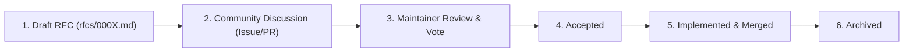

# 🏛️ Project Governance

This document outlines the governance model, roles, voting procedures, and decision-making mechanisms for **NexusAI**.

---

## 👥 Roles & Responsibilities

### 1. Maintainers
- **Responsibilities**: Review Pull Requests, triage issues, manage releases, enforce security policies, approve RFCs.
- **Merge Authority**: Maintainers have ultimate merge authority for the `main` branch.
- **Current Maintainer**: @Irs622 (OSPO / Core Architect)

### 2. Reviewers
- **Responsibilities**: Review PRs for code quality, test coverage, and documentation accuracy.

### 3. Core Contributors
- **Responsibilities**: Submit PRs, participate in RFC discussions, improve tests and specifications.

---

## 🗳️ RFC & Architecture Decision Process

Major architectural changes or public API additions MUST follow the RFC lifecycle:

- **Voting Threshold**: Simple majority among Maintainers (or unanimous approval for breaking API changes).
