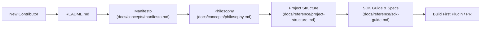
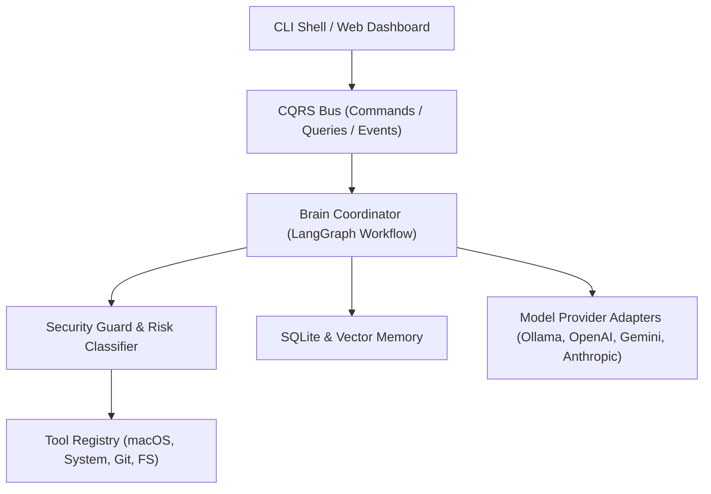

# 🤖 NexusAI (J.A.R.V.I.S.)

> **Model-Agnostic AI Operating System for macOS (Apple Silicon & Intel)**

[](LICENSE)
[](pyproject.toml)
[](SECURITY.md)
[](CODE_OF_CONDUCT.md)
[](docs/concepts/charter.md)

NexusAI (also known as **Jarfis**) is an autonomous, local-first AI Operating System built specifically for macOS. It acts as an intelligent desktop assistant capable of natural language interaction, ambient voice processing, system automation, developer workspace context awareness, tiered RAG knowledge retrieval, and model-agnostic LLM orchestration.

---

## 🗺️ Contributor Onboarding Journey

Whether you are an end-user, plugin developer, or core contributor, welcome! Here is your recommended onboarding path:



👉 **[Explore the Master Documentation Index (docs/index.md)](docs/index.md)**

---

## 💡 Why NexusAI?

Unlike thin API wrappers or closed cloud SaaS tools, NexusAI is designed as a true **Operating System Extension**:

- **Model Agnostic**: Seamlessly switch between local models (Ollama, LM Studio) and cloud APIs (OpenAI, Anthropic, Gemini, OpenRouter).
- **Local-First & Private**: Your files, shell history, and memories remain strictly local in SQLite and local vector stores.
- **Zero-Trust Security**: Built-in permission guard (`SecurityGuard`) and command sanitizer classify all autonomous tool executions before running.
- **CQRS Architecture**: Command Query Responsibility Segregation ensures clean separation between safe queries and state-changing actions.

---

## 🎯 Goals & Non-Goals

### 🟢 Project Goals
- Provide a responsive, local-first AI assistant for macOS desktop automation.
- Maintain startup time under 1.5 seconds and lightweight memory overhead.
- Empower developers to create custom tool plugins in under 50 lines of code.

### 🔴 Non-Goals
- ❌ **Not a Closed Cloud SaaS**: We will never require paid subscription tiers to run core functionality.
- ❌ **Not an IDE Replacement**: NexusAI complements VSCode/JetBrains rather than replacing your code editor.
- ❌ **No Telemetry Harvesting**: Zero tracking of user prompts, code snippets, or personal context.

---

## 🏗️ Architecture Overview



---

## 🚀 Quickstart

### Prerequisites
- macOS (Apple Silicon M1/M2/M3/M4 or Intel)
- Python 3.12+
- `uv` (recommended) or standard `pip`

### Installation

1. **Clone the repository:**
   ```bash
   git clone https://github.com/Irs622/nexusai.git
   cd nexusai
   ```

2. **Set up virtual environment & install dependencies:**
   ```bash
   python3 -m venv .venv
   source .venv/bin/activate
   pip install -e .
   ```

3. **Configure API Keys:**
   ```bash
   cp .env.example .env
   ```
   Open `.env` in your editor and insert your `OPENROUTER_API_KEY` or `OPENAI_API_KEY`.

---

## 💻 Usage Modes

NexusAI can be launched in three modes:

### 1. Interactive Terminal CLI Chat
```bash
nexusai chat
# or: ./.venv/bin/python -m nexusai.cli.app chat
```

### 2. Web Dashboard Interface
```bash
nexusai web
```
Open your browser and navigate to `http://127.0.0.1:8000`.

### 3. Voice Interaction Mode
```bash
nexusai chat --voice
```

---

## 🔌 Plugin Ecosystem (Marketplace Coming Soon)

NexusAI features a modular plugin architecture. Creating a tool plugin is as simple as inheriting from `BaseTool`:

```python
from nexusai.tools.base import BaseTool

class CustomNotifyTool(BaseTool):
    name = "custom_notify"
    description = "Send a custom desktop notification"
    
    async def execute(self, message: str) -> str:
        # Implementation logic here
        return f"Notification sent: {message}"
```

Check out the **[SDK Guide (docs/reference/sdk-guide.md)](docs/reference/sdk-guide.md)** for details.

---

## 📊 Project Maturity & Status

| Area | Status | Maturity |
| :--- | :--- | :--- |
| **CLI Runtime** | Stable | `v0.1.0-alpha` |
| **Web Dashboard** | Beta | `v0.1.0-beta` |
| **Model Adapters** | Stable | OpenAI, OpenRouter, Ollama |
| **Plugin Engine** | Specification Draft | `docs/specs/extensions/plugin.md` |
| **Security Guard** | Stable | LOW..CRITICAL Risk Classifier |

---

## 🤝 Contributing & AI Agent Guidelines

We welcome human developers and AI agent contributions! 

- Please read **[CONTRIBUTING.md](CONTRIBUTING.md)** for developer setup and PR workflows.
- For AI agent contributions, refer to **[AGENTS.md](AGENTS.md)** for strict code conventions and constraints.

---

## 📜 License

Distributed under the official **[MIT License](LICENSE)**. See `LICENSE` for details.
