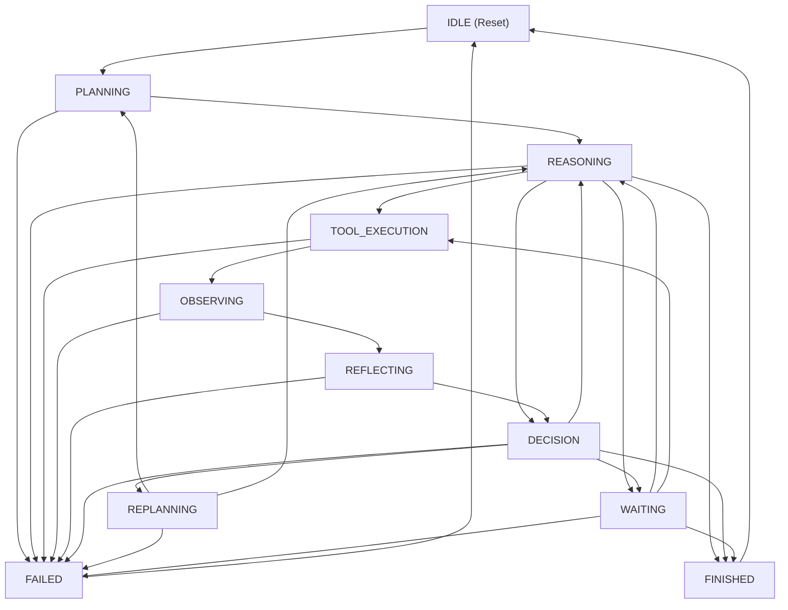

# ADR 0009: Multi-Turn Agent Runtime & Decoupled Loop Orchestration Architecture

## Context

Phase 3.1 established the stateless, provider-agnostic single-turn orchestration runtime (`nexusai.brain`). Phase 3.2 introduces multi-turn autonomous execution through **Planning → Reasoning → Tool → Observation → Reflection → Decision** execution loops.

To maintain architectural integrity, prevent `ExecutionContext` from swelling into a God Object, avoid embedding vendor dependencies in core orchestration, and ensure long-term stability toward Phase 4.0, clear architectural boundaries must govern the Agent Runtime.

---

## State Machine Transition Architecture

### Transition Table

| Source State | Target State | Legal? | Rationale / Trigger |
| :--- | :--- | :---: | :--- |
| `IDLE` | `PLANNING` | ✅ | Start agent goal session |
| `PLANNING` | `REASONING` | ✅ | Goal plan generated |
| `PLANNING` | `WAITING` | ❌ | Cannot wait directly from planning |
| `REASONING` | `TOOL_EXECUTION` | ✅ | Step requires tool call |
| `REASONING` | `FINISHED` | ✅ | All steps completed |
| `TOOL_EXECUTION` | `OBSERVING` | ✅ | Tool execution completed |
| `OBSERVING` | `REFLECTING` | ✅ | Observation normalized |
| `REFLECTING` | `DECISION` | ✅ | Reflection analysis formed |
| `DECISION` | `REASONING` | ✅ | Continue to next step |
| `DECISION` | `REPLANNING` | ✅ | Replan recommended |
| `DECISION` | `FINISHED` | ✅ | Goal complete |
| `DECISION` | `FAILED` | ✅ | Unrecoverable step failure |

---

## Decisions

### 1. `AgentRuntimeContext` Isolation
`WorkingMemory` is managed exclusively within `AgentRuntimeContext.working_memory`. It MUST NOT be attached to `ExecutionContext` or `TelemetryContext` metadata. `TelemetryContext` remains strictly reserved for OpenTelemetry metrics (trace IDs, span IDs, latencies).

### 2. Passive `ExecutionPipeline` & Dedicated `LoopExecutor`
`ExecutionPipeline` remains a passive, single-turn stage runner executing linear stage sequences. Multi-turn iteration control, state machine transitions, and loop flow decisions are orchestrated exclusively by `LoopExecutor`.

### 3. Strategy Interfaces as Public Contracts & `AgentRuntimeBuilder`
Public contracts target abstract interfaces (`IPlanningStrategy`, `IReflectionStrategy`, `IDecisionStrategy`). Strategies are injected into `LoopExecutor` via `AgentRuntimeBuilder`, avoiding hardcoded strategy instantiations inside core execution loops.

### 4. Rich `WorkingMemory` Value Object & Single Source of Truth
`WorkingMemory` tracks plan steps via `steps: list[PlanStep]` and `current_step_index: int`. The current step is dynamically derived to maintain a single source of truth. Ephemeral reasoning (`scratchpad`), output artifacts (`temporary_artifacts`), and cross-step parameters (`context_variables`) are explicitly separated into typed containers.

### 5. Decoupled Tool Ports & `ObservationMapper`
Tool execution passes through the `IToolPort` interface in `nexusai.brain.ports`. The `ToolRegistryAdapter` in `nexusai.tools` adapts `ToolRegistry` implementations. Raw tool execution outcomes (`ToolExecutionResult`) are transformed by `ObservationMapper` into normalized, tool-agnostic `Observation` domain entities before reaching Reflection.

### 6. Pure `AgentStateMachine`
`AgentStateMachine` strictly validates lifecycle transitions across 10 explicit states. It contains zero external calls or orchestration business logic.

---

## Alternatives Considered

### Alternative A: Embedding Working Memory in `ExecutionContext.telemetry.metadata`
- **Status**: Rejected. Violates Separation of Concerns.

### Alternative B: Making `ExecutionPipeline` a Re-Entrant State Machine
- **Status**: Rejected. Distorts single-turn pipeline semantics.

### Alternative C: Exposing `AgentPlanner` as a Direct Public API Class
- **Status**: Rejected. Forces concrete implementation dependency.

---

## Consequences

### Positive
- **Clean Boundaries**: Brain Runtime remains 100% untouched and stateless.
- **High Testability**: `RulePlanningStrategy` and `RuleDecisionStrategy` enable deterministic unit testing without external network access.
- **Robust Tool Isolation**: `IToolPort` and `ObservationMapper` prevent vendor or tool-specific wire formats from leaking into reasoning or reflection engines.
- **Single Source of Truth**: Step indexing prevents state synchronization bugs in `WorkingMemory`.

### Negative / Trade-Offs
- **More Interfaces**: Strategy protocols require explicit builder injection patterns.
- **Context Wrapper Indirection**: `AgentRuntimeContext` wraps `ExecutionContext`, adding one level of composition indirection.

---

## Validation Criteria

This ADR remains valid and accepted IF:
1. `ExecutionContext` sub-contexts strictly comply with field budgets ($\le 5$ fields per sub-context).
2. Multi-turn agent execution runs without modifying `ExecutionPipeline` single-turn contracts.
3. Architecture fitness tests verify zero `WorkingMemory` imports in `ExecutionContext`.
4. Reproducible benchmarks confirm loop overhead $<2.0\text{ms}$.

---

## Review Phase

Phase 4.0 (AI Operating System).
