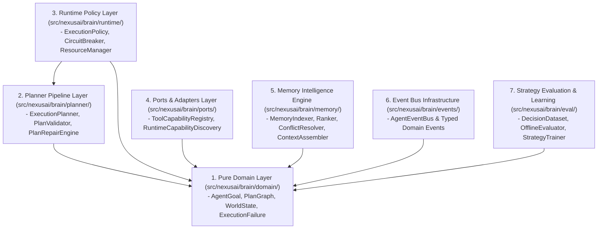
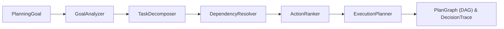
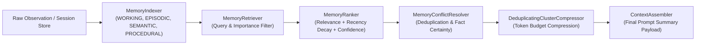
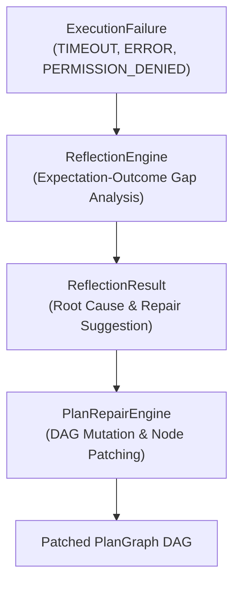
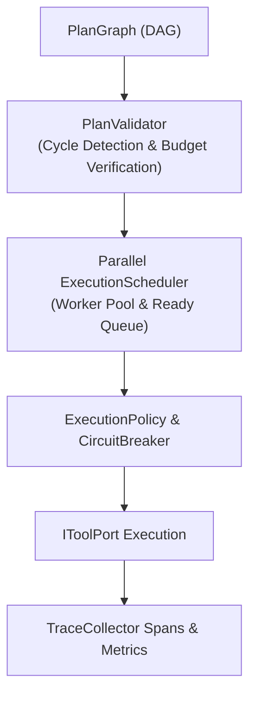
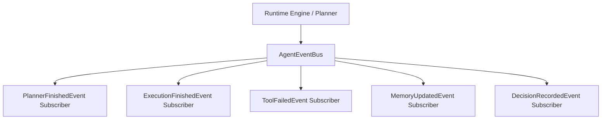
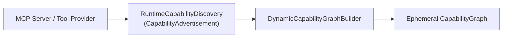
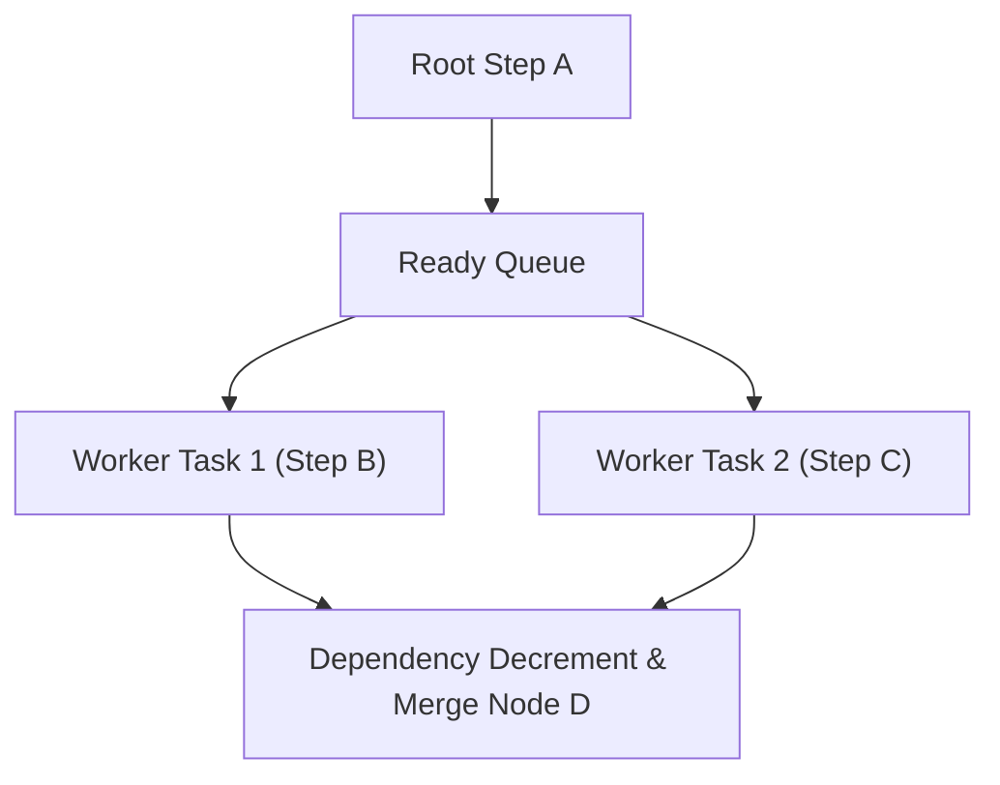
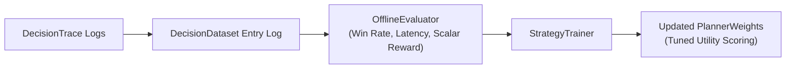

# 🏛️ NexusAI Agent Runtime — Architecture Specification

> **Platform Architecture Reference Document**  
> **Target Python Engine**: Python 3.12+ | Clean Architecture | Zero Circular Dependencies  

---

## 1. Clean Architecture Layers

NexusAI adheres to strict unidirectional Clean Architecture dependency rules:

---

## 2. Planner Pipeline Architecture

The planner processes goals through a 5-stage decoupled pipeline, transforming high-level descriptions into a Directed Acyclic Graph (`PlanGraph`).

---

## 3. Memory Intelligence Pipeline

Memory context processing executes across 5 sequential transformations to maximize relevance and eliminate redundant context:

---

## 4. Expectation Reflection & Plan Repair Pipeline

When a tool fails during execution, the `ReflectionEngine` diagnoses the root cause and `PlanRepairEngine` dynamically re-patches the DAG graph without aborting execution:

---

## 5. Runtime Execution & Policy Pipeline

The `PlanGraphExecutionEngine` executes DAG steps while enforcing runtime sandboxing policies and circuit breakers:

---

## 6. Event-Driven Architecture (`AgentEventBus`)

Components publish typed domain events across the `AgentEventBus` to maintain complete decoupling:

---

## 7. Dynamic Capability Discovery

Tool capabilities are dynamically advertised and resolved at runtime:

---

## 8. Parallel Execution Scheduler

The `ExecutionScheduler` uses an asynchronous worker pool and dependency counter to run independent DAG branches concurrently:

---

## 9. Closed-Loop Strategy Learning

The learning loop accumulates execution trajectories in `DecisionDataset` and automatically tunes scoring weights:

