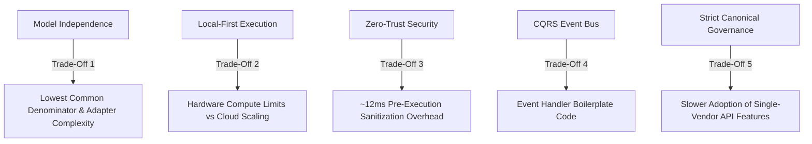

# 🧠 NexusAI Architecture Rationale & Trade-Off Analysis

> **Companion Document to the NexusAI Architecture Manifesto**  
> *Explaining the Deep "Why", Subsystem Responsibilities, Architectural Trade-Offs, and Maintenance Guidance*

---

## 📜 Purpose & Relationship to the Manifesto

While [`docs/concepts/architecture_manifesto.md`](file:///Users/mac/Downloads/jarfis%20projek/docs/concepts/architecture_manifesto.md) serves as the lean, normative constitutional code defining **what** NexusAI is and **what baseline laws** it enforces, this document explains **why** those architectural choices were made, **how subsystems interact**, and **what trade-offs** were accepted.

This document exists to ensure future maintainers understand the deep engineering rationale behind every core abstraction, preventing short-term convenience shortcuts that would compromise the long-term integrity of NexusAI.

---

## 🗺️ Table of Contents

1. [Deep Rationale Behind Key Architectural Axioms](#1-deep-rationale-behind-key-architectural-axioms)
2. [Detailed Subsystem Layer Responsibilities](#2-detailed-subsystem-layer-responsibilities)
3. [Explicit Architectural Trade-Off Analysis](#3-explicit-architectural-trade-off-analysis)
4. [Preventive Guidance & Maintainer FAQ](#4-preventive-guidance--maintainer-faq)

---

## 1. Deep Rationale Behind Key Architectural Axioms

### 1.1 Why "State Must Never Depend on Inference" (Axiom 3)

- **The Problem**: In naive AI applications, conversational memory, active workflow states, and tool capabilities are embedded into long LLM prompts or stored in cloud thread APIs. If an API call times out, a provider changes model weights, or context windows truncate, system state is corrupted or lost.
- **The Rationale**: Inference is non-deterministic and transient. State is deterministic and permanent. By enforcing **Axiom 3**, NexusAI guarantees that conversational history (`nexusai.memory`), agent task graphs (`nexusai.workflow`), tool registries (`nexusai.tools`), and security policies (`nexusai.security`) exist in structured local databases and typed memory graphs. Replacing or failing an LLM inference call NEVER destroys user state.

### 1.2 Why User Memory Must Outlive Model Context Windows

- **The Problem**: Cloud providers frequently push proprietary session APIs (e.g., thread management APIs). Storing memory inside cloud APIs creates catastrophic vendor lock-in and leaves context hostage to vendor pricing or policy deprecation.
- **The Rationale**: User context and historical operational memory are personal property. Storing short-term turns in local SQLite (`aiosqlite`) and long-term knowledge in local vector collections (`BaseVectorStore`) guarantees absolute data privacy, offline execution capability, and instant local search performance.

### 1.3 Why Workflows Must Be Compiled into State Machines

- **The Problem**: Relying on an LLM to remember multi-step execution graphs through natural language system prompts leads to infinite loops, context overflow, parameter hallucination, and unrecoverable crashes.
- **The Rationale**: Multi-step agent tasks are compiled into deterministic state machines executed by the durable NexusAI Workflow Engine (`nexusai.workflow`). The LLM is invoked as an inference step within a single node; it does NOT manage the state machine loop itself.

---

## 2. Detailed Subsystem Layer Responsibilities

| Subsystem Package | Primary Responsibility | Architectural Guarantee | Governance Reference |
| :--- | :--- | :--- | :--- |
| `nexusai.providers` | Manages LLM transport adapters, wire format translators, health monitoring (`HealthMonitor`), policy routing (`ProviderRouter`), circuit breakers (`CircuitBreaker`), and middleware pipelines (`BaseMiddleware`). | 100% stateless wire translation. Zero state leakage. | [ADR-0006](file:///Users/mac/Downloads/jarfis%20projek/docs/adr/0006-provider-sdk.md), [ADR-0007](file:///Users/mac/Downloads/jarfis%20projek/docs/adr/0007-canonical-model-evolution.md) |
| `nexusai.runtime` | Provides low-level execution kernel primitives: execution state machines (`ExecutionStateMachine`), cancellation tokens (`CancellationToken`), deadlines (`Deadline`), and execution contexts (`ExecutionContext`). | Deterministic task state transitions & cancellation propagation. | [ADR-0006](file:///Users/mac/Downloads/jarfis%20projek/docs/adr/0006-provider-sdk.md) |
| `nexusai.brain` | Coordinates agent loop execution (`AgentLoop`), prompt compilation, reasoning strategy evaluation, planning, and immutable observation event recording (`Observation`). | Functional state reducers & frozen observation logs. | [ADR-0004](file:///Users/mac/Downloads/jarfis%20projek/docs/adr/0004-immutable-agent-context.md), [ADR-0005](file:///Users/mac/Downloads/jarfis%20projek/docs/adr/0005-reasoning-and-observation-architecture.md) |
| `nexusai.bus` | Dispatches system Commands (write operations), Queries (side-effect-free reads), and Events (system telemetry) ensuring strict CQRS decoupling. | Clean separation of safe queries from guarded state modifications. | Core Architectural Directives |
| `nexusai.security` | Evaluates tool call requests against a zero-trust risk matrix (`LOW`, `MEDIUM`, `HIGH`, `CRITICAL`), sanitizes command strings (`CommandSanitizer`), and manages user approval prompts. | Pre-execution safety inspection boundary. | [ADR-0003](file:///Users/mac/Downloads/jarfis%20projek/docs/adr/0003-security-evaluator.md) |
| `nexusai.memory` | Manages dual-tier conversation persistence (SQLite via `aiosqlite`) and hierarchical memory graphs. | Local offline history persistence. | [ADR-0002](file:///Users/mac/Downloads/jarfis%20projek/docs/adr/0002-memory-storage.md) |
| `nexusai.knowledge` | Manages local vector embedding storage (`BaseVectorStore`) for workspace indexing and RAG retrieval. | Local context retrieval without cloud exfiltration. | [ADR-0002](file:///Users/mac/Downloads/jarfis%20projek/docs/adr/0002-memory-storage.md) |
| `nexusai.workflow` | Executes multi-step declarative workflow graphs with state recovery and retry boundaries. | Durable multi-step workflow persistence. | Workflow Specification |
| `nexusai.automation` | Manages background task scheduling, cron triggers, and time-based agent triggers (`Scheduler`). | Background task execution decoupling. | System Architecture |
| `nexusai.tools` | Hosts tool registry (`ToolRegistry`), plugin loader (`plugin_loader.py`), sandboxing, and OS driver interfaces (`nexusai.tools.macos`, etc.). | Minimalist driver plugin extensions. | [ADR-0001](file:///Users/mac/Downloads/jarfis%20projek/docs/adr/0001-plugin-system.md) |

---

## 3. Explicit Architectural Trade-Off Analysis

Every platform architecture is defined by the trade-offs it consciously accepts. NexusAI acknowledges and accepts five core trade-offs:

### Trade-Off 1: Model Independence vs. Lowest Common Denominator & Adapter Overhead
- **Chosen Path**: Enforce model-agnostic canonical contracts (`ChatRequest`, `ChatResponse`, `Capability`).
- **Pros (+)**: Total vendor independence; swappable local and cloud brains; zero state loss when upgrading models.
- **Cons (-)**: Advanced single-vendor features cannot enter canonical abstractions until supported by at least two independent providers ([ADR-0007](file:///Users/mac/Downloads/jarfis%20projek/docs/adr/0007-canonical-model-evolution.md)). Requires maintaining translator adapters for each vendor format.
- **Conscious Decision**: **Accepted**. Vendor isolation is vital for long-term project survival. Single-vendor features remain isolated in raw trace metadata (`response.trace`).

---

### Trade-Off 2: Local-First Execution vs. Hardware Compute Resource Limits
- **Chosen Path**: Prioritize local SQLite storage, local vector embeddings, and on-device model inference.
- **Pros (+)**: 100% offline capability; context privacy; zero data exfiltration; zero recurring cloud cost.
- **Cons (-)**: On-device inference on constrained hardware is slower than massive cloud clusters. Vector stores consume local memory and disk.
- **Conscious Decision**: **Accepted**. NexusAI uses a capability-based router (`ProviderRouter`): privacy-critical state and basic tasks run locally, while heavy reasoning tasks route to cloud adapters via explicit zero-trust user authorization.

---

### Trade-Off 3: Zero-Trust Security Guard vs. Execution Latency
- **Chosen Path**: Intercept every tool request using `SecurityGuard` risk classification and `CommandSanitizer` validation.
- **Pros (+)**: Complete protection against prompt injection, destructive shell execution (`rm -rf`), and unauthorized network access.
- **Cons (-)**: Pre-execution inspection adds ~12ms per tool call and requires confirmation prompts for `HIGH`/`CRITICAL` risk tiers.
- **Conscious Decision**: **Accepted**. User safety and digital sovereignty strictly take precedence over minor latency optimization.

---

### Trade-Off 4: CQRS Decoupling vs. Codebase Complexity
- **Chosen Path**: Separate read-only Queries (`QueryBus`) from state-modifying Commands (`CommandBus`).
- **Pros (+)**: Clean architectural separation; safe queries run fast without side effects; state mutations leave complete audit trails.
- **Cons (-)**: Requires defining explicit Command/Query classes and bus handlers.
- **Conscious Decision**: **Accepted**. CQRS guarantees system auditability and prevents accidental side-effects during autonomous agent loops.

---

### Trade-Off 5: Strict Canonical Governance (ADR-0007) vs. Single-Vendor Feature Hype
- **Chosen Path**: Require multi-provider evidence (minimum 2 independent vendor implementations) before extending canonical SDK schemas.
- **Pros (+)**: Prevents contract fragility, API creep, and breaking changes across SDK releases.
- **Cons (-)**: Does not immediately adopt day-one proprietary vendor SDK tricks until a second vendor adopts similar domain capabilities.
- **Conscious Decision**: **Accepted**. SemVer contract stability takes precedence over chasing single-vendor marketing hype.

---

## 4. Preventive Guidance & Maintainer FAQ

> [!CAUTION]
> **Warning to Maintainers**: Before submitting a PR that alters architectural boundaries, read the following FAQ.

### Q1: *"Can we save development time by storing user conversation state directly in cloud session APIs (e.g. OpenAI Threads)?"*
**Answer: NO.**  
Doing so violates **Axiom 1 (User owns system)**, **Axiom 2 (AI does not own state)**, and **Axiom 3 (State must never depend on inference)**. Provider session APIs lock user state into proprietary clouds. Storage MUST remain local in `nexusai.memory` (SQLite).

### Q2: *"Can we put multi-step workflow instructions inside a long LLM system prompt instead of writing a Workflow Engine class?"*
**Answer: NO.**  
Doing so violates **Principle 6 (Workflow Persistence)** and **Axiom 3**. Prompts are non-deterministic. Workflows MUST be compiled into deterministic execution graphs managed by `nexusai.workflow`.

### Q3: *"Can we skip SecurityGuard risk classification for internal system tools?"*
**Answer: NO.**  
Doing so violates **Principle 10 (Privacy & Zero-Trust)**. Prompt injection attacks can manipulate benign tool arguments. ALL tool execution requests MUST pass through `SecurityGuard` and `CommandSanitizer`.

---

*End of Architecture Rationale — NexusAI Core Architecture Team*
