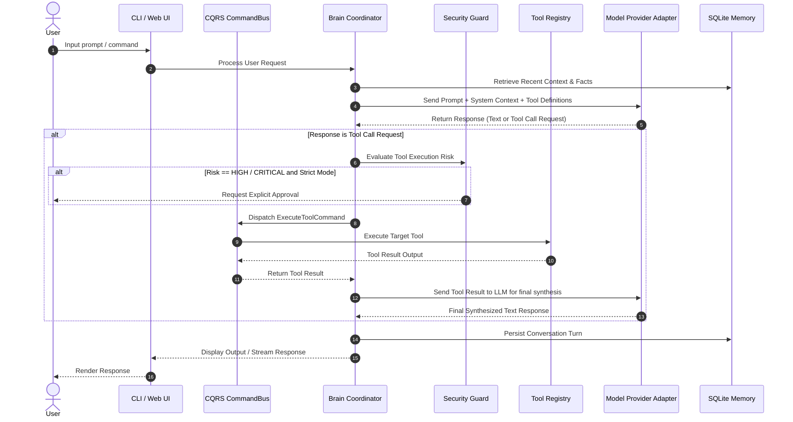

# 📐 System Design & Component Interactions

This document outlines how the primary subsystems of **NexusAI** interact during application execution.

---

## 🏗️ High-Level Interaction Diagram

---

## 🧩 Subsystem Responsibility Breakdown

| Subsystem | Responsibilities | Key Classes |
| :--- | :--- | :--- |
| **CLI / Gateway** | Interactive terminal shell, web dashboard server, user command parsing | `nexusai.cli.app`, `nexusai.api.server` |
| **CQRS Bus** | Decoupled message passing for Commands, Queries, and Events | `CommandBus`, `QueryBus`, `EventBus` |
| **Brain Coordinator** | Workflow graph execution, LLM prompt assembly, tool call routing | `BrainCoordinator`, `GraphWorkflow` |
| **Security Guard** | Risk classification (LOW..CRITICAL), command string sanitization | `SecurityGuard`, `CommandSanitizer` |
| **Tool Registry** | Registration, discovery, and schema validation of tool plugins | `ToolRegistry`, `BaseTool` |
| **Model Provider** | Model-agnostic adapter for OpenAI, Anthropic, Gemini, Ollama | `OpenAIProvider`, `BaseModelProvider` |
| **SQLite Memory** | Local storage for conversation history, system state, and facts | `SQLiteMemory`, `BaseMemory` |

---

## 🔄 Event-Driven Pipeline

All significant state changes emit asynchronous events onto the `EventBus`:
- `ToolExecutedEvent`: Published after any tool completes execution.
- `MemoryUpdatedEvent`: Published when new facts or turns are saved.
- `SecurityAlertEvent`: Published when a dangerous command is blocked.

This allows external monitors, web dashboards, and audit loggers to react without coupling to core business logic.
