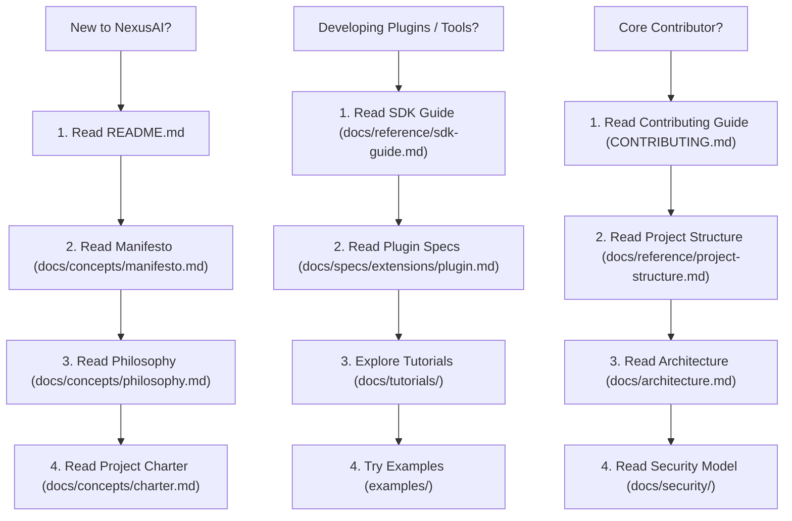

# 📚 NexusAI Documentation Index

Welcome to the central documentation index for **NexusAI** (Jarfis), the Model-Agnostic AI Operating System for macOS.

---

## 🗺️ Documentation Reading Journey

Follow this recommended reading path depending on your role:

---

## 📂 Navigation Index by Category

### 💡 Core Concepts & Rationale (`docs/concepts/`)
- 📜 **[Manifesto](concepts/manifesto.md)** — The 7 core beliefs & cultural values of NexusAI.
- 🧠 **[Philosophy](concepts/philosophy.md)** — Technical strategy & rationale ("Why NexusAI Exists").
- 📐 **[System Design](concepts/design.md)** — Subsystem component interaction model.
- 🎯 **[Project Charter](concepts/charter.md)** — In-Scope, Out-of-Scope boundaries & success metrics.
- 🏗️ **[Engineering Principles](concepts/principles.md)** — Core software design tenets.

### 🔌 Developer & Plugin Reference (`docs/reference/`)
- 🗺️ **[Project Structure](reference/project-structure.md)** — Codebase directory layout & module mapping.
- 🔌 **[Plugin SDK Guide](reference/sdk-guide.md)** — Building custom tools & extensions.
- ⚙️ **[Configuration Reference](reference/configuration.md)** — Complete `default.yaml` & `security.yaml` reference.
- 🔑 **[Environment Variables](reference/environment-variables.md)** — Required & optional environment variables.
- 🤖 **[AI Providers](reference/ai-providers.md)** — Configuring OpenAI, Anthropic, Gemini, Ollama, OpenRouter.
- 🔄 **[Versioning Policy](reference/versioning.md)** — SemVer 2.0.0, API stability, deprecations.
- 🧩 **[Plugin Compatibility](reference/plugin-compatibility.md)** — SDK versioning matrix.
- ⚡ **[Performance Methodology](reference/performance.md)** — Benchmarking targets & latency measurement.
- 💻 **[System Compatibility](reference/compatibility.md)** — macOS & Python version support.

### 📐 Formal Specifications (`docs/specs/`)
- **Core Engine Specs**:
  - ⚙️ **[Runtime Specification](specs/core/runtime.md)**
  - 🧠 **[Memory Subsystem Specification](specs/core/memory.md)**
  - 🔄 **[Workflow Engine Specification](specs/core/workflow.md)**
- **Extension Specs**:
  - 🔌 **[Plugin Specification](specs/extensions/plugin.md)**
  - 🤖 **[Provider Specification](specs/extensions/provider.md)**
  - 🛠️ **[Tool Specification](specs/extensions/tool.md)**

### 🛡️ Security Architecture (`docs/security/`)
- 🔑 **[Permission Model](security/permission-model.md)** — Risk evaluator levels & permission checks.
- 🛝 **[Tool Sandbox](security/tool-sandbox.md)** — Execution boundaries & command sanitization.
- 🛡️ **[Threat Model](security/threat-model.md)** — Defense-in-depth architecture.

### 📖 Guides, Tutorials & FAQ
- 📖 **[Developer Setup](development.md)** — Setting up local dev environment.
- 📖 **[Coding Style Guide](coding-style.md)** — Formatting, typing, and quality standards.
- 📖 **[System Lifecycle](lifecycle.md)** — App execution flowchart from boot to shutdown.
- 📖 **[Glossary](glossary.md)** — Terminology dictionary (Brain, Bus, Guard, Adapter, etc.).
- ❓ **[Frequently Asked Questions](faq.md)** — Targeted FAQs.
- 🔧 **[Troubleshooting Guide](troubleshooting.md)** — Solutions for common issues.

---

## 🏛️ Governance & ADRs
- 📋 **[Architecture Decision Records](adr/)** — ADR 0001 to ADR 0004.
- 🧠 **[Technical Decisions Rationale](decisions/)** — Why Python, Why SQLite, Why CQRS, Why Typer/Rich, Why Workflow Engine.
- 📄 **[RFC Proposals](rfcs/)** — RFC 0001 Core Architecture.
