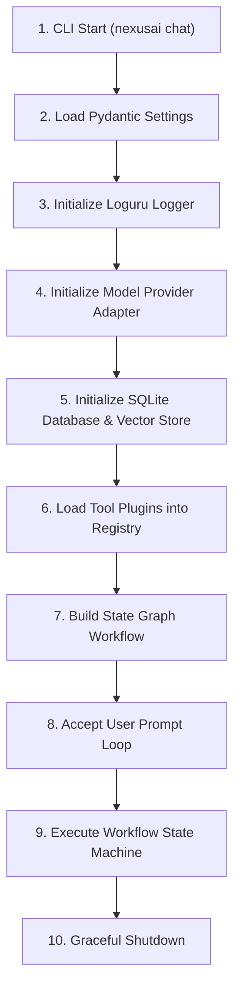

# 📖 Application Lifecycle

```mermaid
flowchart TD
    A["1. CLI Start (nexusai chat)"] --> B["2. Load Pydantic Settings"]
    B --> C["3. Initialize Loguru Logger"]
    C --> D["4. Initialize Model Provider Adapter"]
    D --> E["5. Initialize SQLite Database & Vector Store"]
    E --> F["6. Load Tool Plugins into Registry"]
    F --> G["7. Build State Graph Workflow"]
    G --> H["8. Accept User Prompt Loop"]
    H --> I["9. Execute Workflow State Machine"]
    I --> J["10. Graceful Shutdown"]
```
