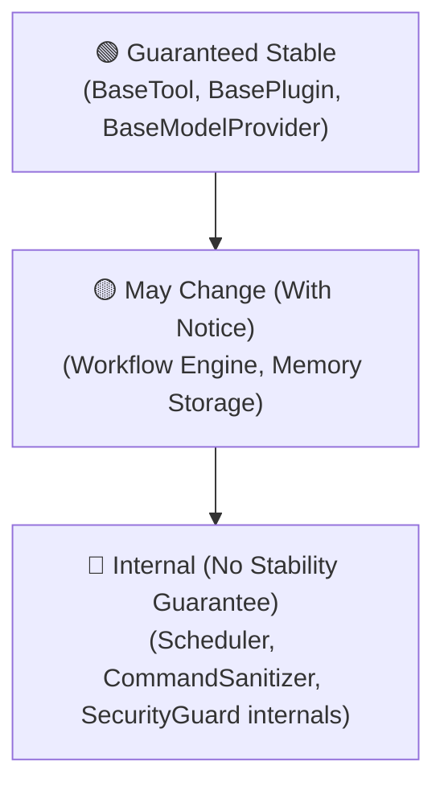

# 🛡️ API Stability Matrix & Compatibility Promise

This document defines the stability status of NexusAI API surfaces and establishes breaking change guarantees for developers.

---

## 📊 API Stability Tiers

### 1. 🟢 Guaranteed Stable (SemVer Protected)
Public interfaces under `nexusai.tools.base` and `nexusai.models.base`. Changes require a MAJOR version bump and 1 MINOR release deprecation period.
- `BaseTool` (methods: `execute`)
- `BasePlugin` (methods: `get_tools`, `on_load`, `on_unload`)
- `BaseModelProvider` (methods: `generate_response`)

### 2. 🟡 May Change (Beta / Experimental)
Evolving interfaces that may be updated across MINOR versions with deprecation warnings:
- `BrainCoordinator` workflow state schema (`AgentState`)
- `BaseMemory` vector search methods

### 3. 🔴 Internal (No Public Guarantee)
Private runtime implementation details:
- `nexusai.automation.scheduler` internal jobs
- `CommandSanitizer` regex patterns
