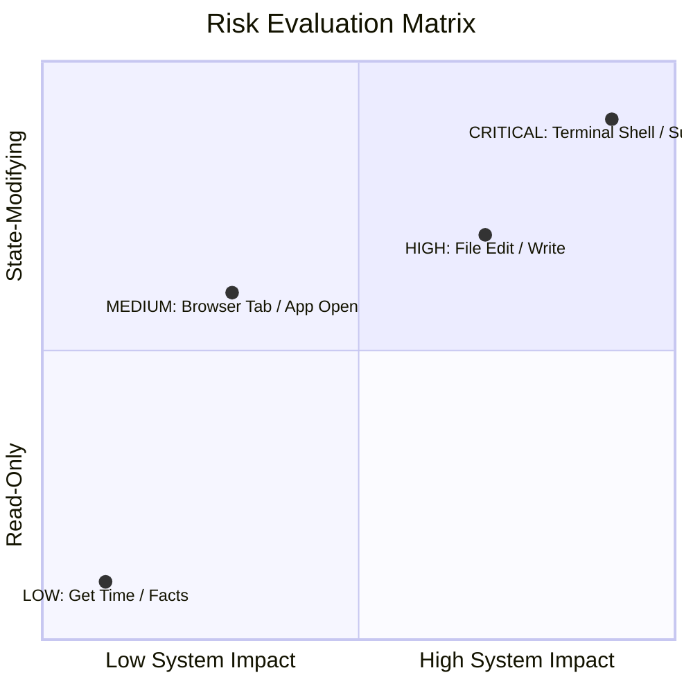

# 🔑 Permission Model & Risk Evaluation

## 1. Overview

The **NexusAI Permission Model** classifies every tool invocation into one of four risk levels to prevent unauthorized or destructive execution.

---

## 🚦 Risk Classification Matrix

### Risk Level Definitions

1. **`LOW` (Auto-Approved)**
   - Read-only operations, memory recall, active window queries.
2. **`MEDIUM` (Logged)**
   - Reversible UI actions, opening apps, non-destructive queries.
3. **`HIGH` (User Prompt in Strict Mode)**
   - File system writes, configuration overrides, system notifications.
4. **`CRITICAL` (Explicit Confirmation Required)**
   - Subprocess terminal execution, shell scripts, AppleScript automation.
