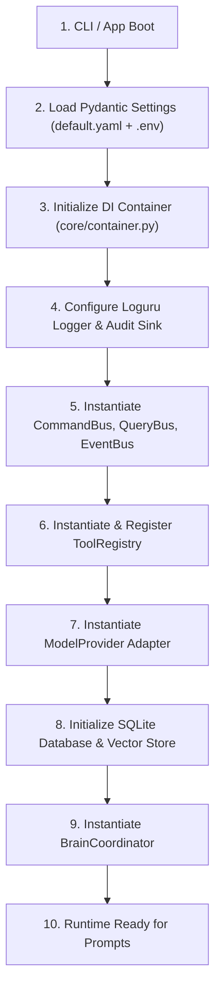

# ⚙️ Core Runtime Specification

## 1. Overview

The **NexusAI Core Runtime** manages application startup, dependency injection container initialization, configuration loading, CQRS bus wiring, and execution loop orchestration.

---

## 2. Startup Pipeline

---

## 3. Core Runtime Contracts

### 3.1 Error Handling Specification
All exceptions emitted by the runtime MUST inherit from `NexusAIError`:
- `ConfigurationError`: Emitted when settings or required environment variables are missing/malformed.
- `SecurityViolationError`: Emitted when a command is blocked by the security guard.
- `ModelProviderError`: Emitted when an LLM provider call fails or returns unparseable JSON.
- `ToolExecutionError`: Emitted when a tool fails during execution.

### 3.2 Threading & Async Execution
- The runtime operates strictly on an `asyncio` event loop.
- Blocking synchronous operations (e.g. file IO, subprocess calls) MUST be executed using `asyncio.to_thread` or async native libraries (`aiosqlite`, `aiofiles`).
