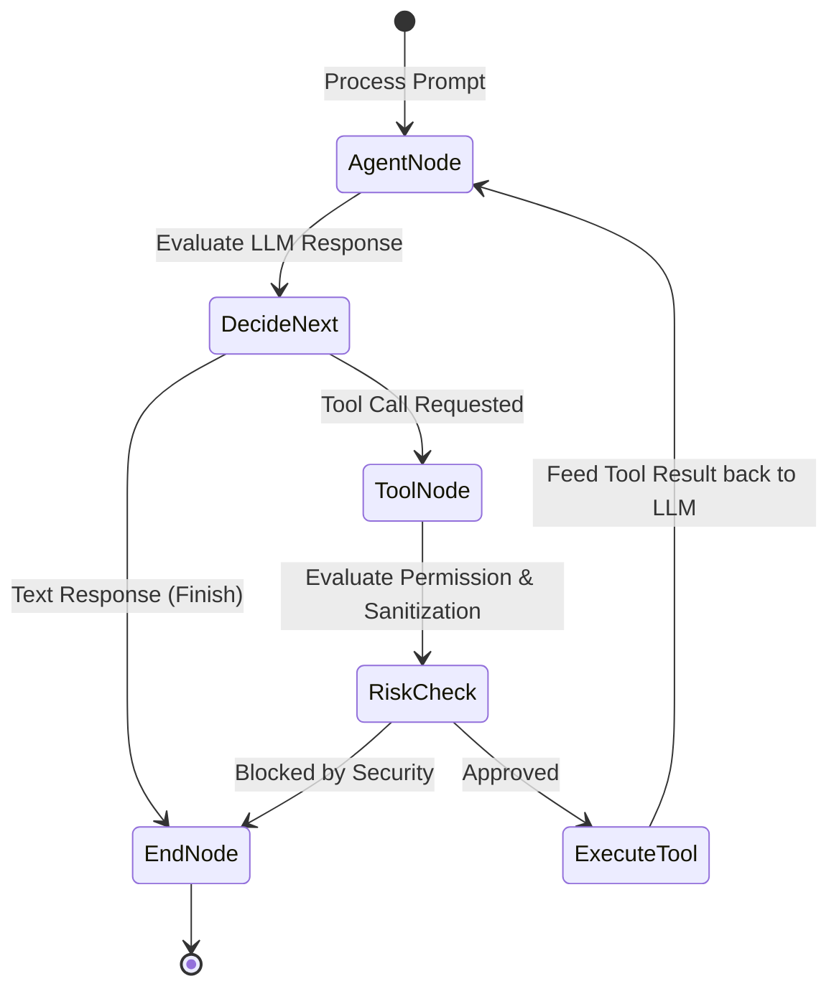

# 🔄 Workflow Engine Specification

## 1. Overview

The Workflow Engine manages cyclic agent state transitions during prompt processing, tool invocation, and multi-turn reasoning loops using a state graph.

---

## 2. Agent State Specification (`AgentState`)

The state dictionary passed through workflow nodes is defined as a Pydantic model:

```python
from typing import Any, Dict, List, Optional
from pydantic import BaseModel, Field

class AgentState(BaseModel):
    messages: List[Dict[str, Any]] = Field(default_factory=list)
    next_step: str = "agent"
    pending_tool_call: Optional[Dict[str, Any]] = None
    tool_output: Optional[str] = None
    is_finished: bool = False
    error: Optional[str] = None
```

---

## 3. State Graph Transitions



---

## 4. Node Responsibilities
- **`agent`**: Assembles history + system prompt, calls `ModelProvider`, returns text or tool request.
- **`tools`**: Dispatches tool command to `CommandBus` and retrieves execution result string.
- **`should_continue`**: Conditional edge function returning `"tools"` or `"end"`.
