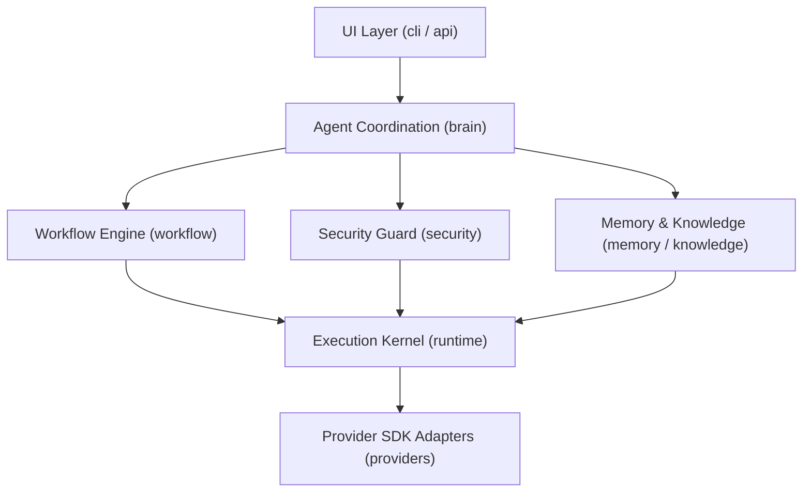

# NexusAI Architectural Layer Dependency Graph & Rule Compliance

Authoritative architectural audit report generated from Abstract Syntax Tree (AST) static analysis.

## Executive Architecture Health Score

| Health Metric | Current Value | Target Threshold |
| :--- | :--- | :--- |
| **Boundary Integrity** | **100.0%** | 100.0% |
| **Layer Replaceability** | **100.0%** | 100.0% |
| **Dependency Health** | **100.0%** | ≥ 95.0% |
| **Technical Debt Score** | **100.0%** (0 exceptions) | 100.0% |
| **Documentation Score** | **100.0%** | 100.0% |
| **Observability Score** | **100.0%** | ≥ 90.0% |
| **OVERALL ARCHITECTURE HEALTH** | **100 / 100** | ≥ 90 / 100 |

---

## Architectural Layer Dependency Map

---

## Active Architectural Rules & Status

| Rule ID | Directive | Status | Violations |
| :--- | :--- | :--- | :--- |
| **A001** | `providers` MUST NOT import `runtime`, `brain`, `memory`, `workflow`, `automation` | `PASS (Clean)` | 0 |
| **A002** | `runtime` MUST NOT import concrete provider adapters | `PASS (Clean)` | 0 |
| **A003** | `brain` MUST depend only on provider abstractions | `PASS (Clean)` | 0 |
| **A004** | `memory` MUST remain provider-independent | `PASS (Clean)` | 0 |
| **A005** | `workflow` MUST remain provider-independent | `PASS (Clean)` | 0 |
| **A006** | `security` layer MUST NOT import concrete providers | `PASS (Clean)` | 0 |
| **A007** | Core packages MUST NOT instantiate concrete providers directly | `PASS (Clean)` | 0 |
| **A008** | Core packages MUST resolve providers only through `ProviderRegistry` | `PASS (Clean)` | 0 |
| **A009** | `memory.domain` MUST NOT import infrastructure/storage/vector/embedding | `PASS (Clean)` | 0 |
| **A010** | Repositories MUST NOT import other repositories directly | `PASS (Clean)` | 0 |
| **A011** | Storage engines MUST NOT import embedding providers | `PASS (Clean)` | 0 |
| **A012** | UseCases MUST NOT import concrete storage implementations | `PASS (Clean)` | 0 |
| **A013** | `kernel` MUST NOT import `memory` module | `PASS (Clean)` | 0 |
| **A014** | `RetrievalPipeline` MUST remain immutable | `PASS (Clean)` | 0 |
| **A015** | Embedding Provider MUST NOT import VectorStore | `PASS (Clean)` | 0 |
| **A016** | VectorStore MUST NOT import Storage | `PASS (Clean)` | 0 |
| **A017** | Serializer MUST NOT import Repository | `PASS (Clean)` | 0 |
| **A018** | UseCase MUST NOT import concrete Provider directly | `PASS (Clean)` | 0 |
| **A019** | Compliance test suites MUST NOT import implementation except target test | `PASS (Clean)` | 0 |
| **A020** | PipelineFactory MUST NOT instantiate provider | `PASS (Clean)` | 0 |

---

*Report generated automatically by `tools/run_architecture_tests.py`*
